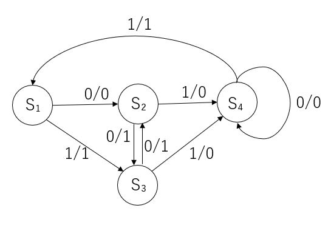

# オートマン(有限オートマン)

オートマンとは、機能を入力や状態、出力で表すシステムのモデル。

モデルとは、現実世界にある複雑なモノを単純化してわかりやすくすること。

- 状態(state) : システムが今どんな状況にあるのかを示すもの
- 入力(input) : 何かのイベントや操作
- 遷移(transition) : 入力によって状態がどう変化するか(しないか)
- 初期状態(start state)
- 終了状態(accept atate) : 受理状態

## 状態遷移表

オートマンにおける状態は、時間や操作、イベントによって、初期状態からいくらかの状態を遷移し、最終的な状態に行き着く。

この最終的な状態を`受理状態`という。

- 状態遷移表 : 状態の遷移を表で表したもの
- 状態遷移図 : 状態の遷移を図で表したもの

状態遷移図イメージ:

|       | イベントa | イベントb | イベントc | イベントd | イベントe |
|-------|-----------|-----------|-----------|-----------|-----------|
| 状態A | 状態B     | -         | 状態B     | -         | -         |
| 状態B | -         | 状態A     | -         | -         | 状態C     |
| 状態C | -         | -         | -         | 状態A     | -         |

例えば、初期状態をAとして、イベントC => イベントd => イベントeだと、最終的な状態はC

## 状態遷移図

状態は円、受理状態は二重丸。

矢印の数字(0/0や1/1)は入力/出力。

[参考サイト: デジタルプラス塾](https://digitalplus-school.com/fe_basic-automaton/)

