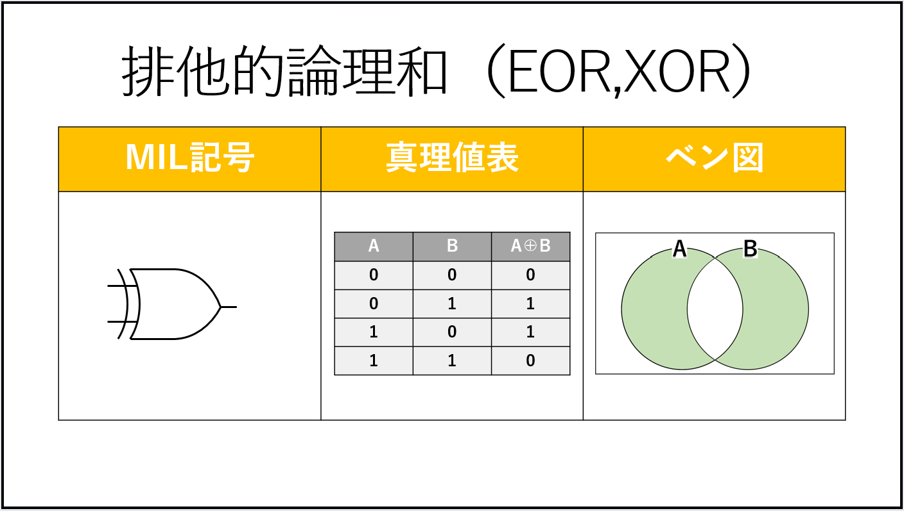

# 論理演算

真と偽の2種類で行う演算。

=> コンピューター内部では真を1、偽を0に対応させたビット演算として行われることが多い

## 論理和

入力(A,B)の少なくともどちらか一方が1であれば、出力(A+B)は1となる演算。

=> `+`は論理和を表す

## 論理積

入力(A,B)の両方が1であれば、出力(A・B)は1となる演算。

=> `・`は論理積を表す。

## 否定

## 排他的論理和

## 否定論理和

## 否定論理積

