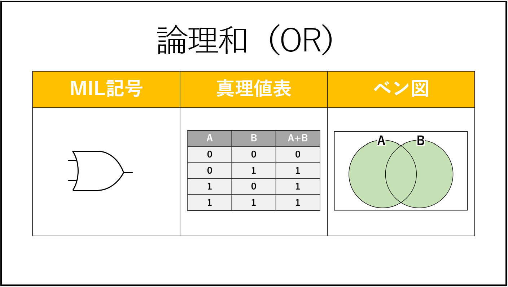

# 論理演算

真と偽の2種類で行う演算。

=> コンピューター内部では真を1、偽を0に対応させたビット演算として行われることが多い

## 論理和

入力(A,B)の少なくともどちらか一方が1であれば、出力(A+B)は1となる演算。

=> `+`は論理和を表す

| A | B | A + B |
|---|---|-------|
| 0 | 0 | 0     |
| 0 | 1 | 1     |
| 1 | 0 | 1     |
| 1 | 1 | 0     |

## 論理積

