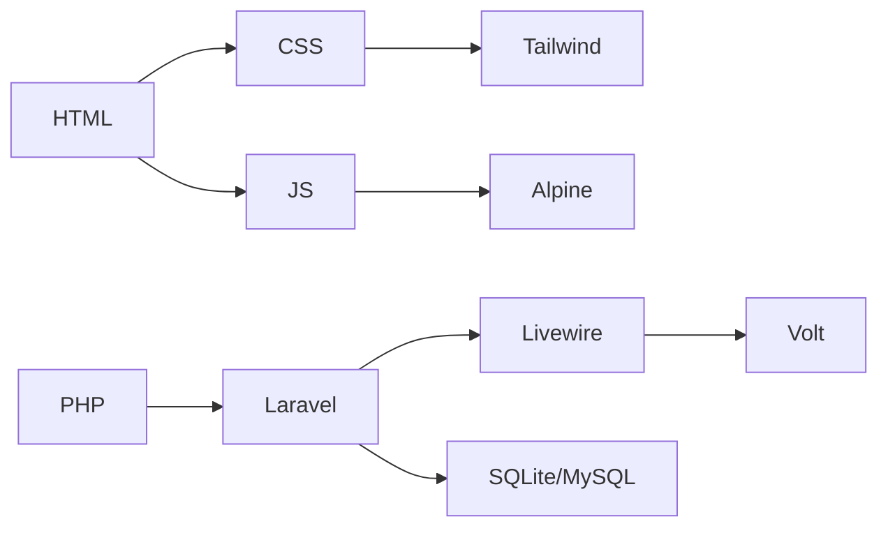

# 🐶 Web関連ドキュメント 🐶

  
  
  
  

| 言語                        | Webでの役割              |
|-----------------------------|--------------------------|
| [HTML](html.md)             | ページの骨格             |
| [CSS](css.md)               | ページの見た目           |
| [JavaScript](javascript.md) | ページの動き(ブラウザ側) |
| [PHP](php.md)               | 裏側の処理(サーバー側)   |
| [Laravel](laravel.md)       | PHPフレームワーク        |

---

## HTML

| リンク                                            | 内容                         |
|---------------------------------------------------|------------------------------|
| [head](./html/head.md)                            | headタグ                     |
| [CSS](./html/css.md)                              | CSS適用の為の基本            |
| [pre](./html/pre.md)                              | brとpre                      |
| [リスト](./html/list.md)                          | ul, ol, dl                   |
| [画像](./html/img.md)                             | 画像を読み込んで表示         |
| [input](./html/input.md)                          | `<input>`タグいろいろ        |
| [textareaの罠](./html/textarea.md)                | value属性を持たない          |
| [label](./html/label.md)                          | 名札(ラベル)をつける         |
| [表](./html/table.md)                             | `<table>`タグ                |
| [ブロックとインライン](./html/block.md)           | 領域の違い                   |
| [required属性](./html/required.md)                | HTML5バリデーション          |
| [プルダウン](./html/select.md)                    | `<select>`タグ               |
| [span](./html/span.md)                            | ``タグ                 |
| [HTMLエンティティ](./html/entity.md)              | 特別な文字や記号             |
 
## CSS

| リンク                                            | 内容                         |
|---------------------------------------------------|------------------------------|
| [リセットCSS](./css/reset_css.md)                 | デフォルトCSS・リセットCSS   |
| [セレクタ](./css/selector.md)                     | セレクタ基礎                 |
| [ボックスモデル](./css/box_model.md)              | 6つの領域                    |
| [色](./css/color.md)                              | CSSで色を指定するには?       |
| [フォント](./css/font.md)                         | フォント関連                 |
| [枠線](./css/border.md)                           | 枠線関連                     |
| [余白](./css/margin.md)                           | 余白関連                     |
| [FlexBox](./css/flexbox.md)                       | フレックスボックス           |

## PHP

| リンク                                            | 内容                         |
|---------------------------------------------------|------------------------------|
| [型](./php/type.md)                               | 型と型宣言                   |
| [変数](./php/var.md)                              | 変数                         |
| [定数](./php/constant.md)                         | 定数                         |
| [条件分岐](./php/if.md)                           | if文                         |
| [条件分岐2](./php/switch.md)                      | switch文                     |
| [配列(基本)](./php/array.md)                      | 配列の基本                   |
| [配列(操作)](./php/array_op.md)                   | 配列の操作                   |
| [多次元配列](./php/array_multi.md)                | 多次元配列                   |
| [繰り返し処理](./php/for.md)                      | 基本4種                      |
| [関数](./php/function.md)                         | 関数                         |
| [無名関数・コールバック関数](./php/function_2.md) | 関数その2                    |
| [スコープ](./php/scope.md)                        | 変数の有効範囲               |
| [フォーム連携](./php/form.md)                     | POSTとバリデーション         |
| [フォームの入力内容保持](./php/form_2.md)         | エラー時に再表示             |
| [演算子関連](./php/operator.md)                   | null合体演算子               |
| [テンプレート構文](./php/template_syntax.md)      | HTMLとPHP混ぜるとき          |
| [PHP関数](./php/php_function.md)                  | htmlspecialchars()とか       |
| [POSTとGET](./php/post_get.md)                    | データの送る方法             |
| [フォーム(3ステップ)](./php/form_3step.md)        | 入力・確認・完了画面         |
| [フォーム(session)](./php/form_session.md)        | Sessionで「戻る」            |
| [ファイルアップロード](./php/upload.md)           | ファイルアップロードの基本   |
| [ファイルアップロード変数](./php/file.md)         | `$_FILE`関連                 |
| [path操作](./php/path_op.md)                      | mkdir, basename              |
| [ファイル読み書き](./php/write_read.md)           | `file_xxx_contents()`        |
| [PHP組み込みWebサーバー](./php/php_server.md)     | `php -S`のやつ               |
| [bin2hex](./php/bin2hex.md)                       | `var_dump`と`ramdom_bytes`も |
| [nl2br](./php/nl2br.md)                           | 改行文字に改行タグ           |
| [json](./php/json.md)                             | JSONに変換                   |
| [usort](./php/usort.md)                           | ユーザー指定の並び替え       |
| [match式](./php/match.md)                         | swithc文の進化版             |
| [オブジェクト指向](./php/oop.md)                  | PHPのオブジェクト指向(基本)  |
| [コンストラクタ](./php/construct.md)              | オブジェクト生成時に実行     |
| [static](./php/static.md)                         | クラス全体に属する           |
| [名前空間](./php/namespace.md)                    | 名前空間はクラスの住所(?)    |
| [クラス関連メモ](./php/class_memo.md)             | クラス関連のメモ             |
| [例外処理](./php/try.md)                          | try/cathc構文                |
| [PDO](./php/PDO.md)                               | PHP Data Objects             |

## Laravel

| リンク                                            | 内容                         |
|---------------------------------------------------|------------------------------|
| [Composer](./laravel/composer.md)                 | Laravelで必要なやつ          |
| [MVC](./laravel/mvc.md)                           | Laravelの設計パターン        |
| [artisan](./laravel/artisan.md)                   | Laravel標準のCLI             |
| [CRUD](./laravel/crud.md)                         | RESTfulな設計                |
| [Blade](./laravel/blade.md)                       | Bladeテンプレート            |
| [View](./laravel/view.md)                         | Viewの命名規則など           |
| [マイグレーション](./laravel/migration.md)        | マイグレーション             |
| [routes](./laravel/routes.md)                     | ルーティング                 |
| [Route Mode Binding](./laravel/rmb.md)            | Laravelの便利なやつ          |
| [Eloquent ORM](./laravel/eorm.md)                 | オブジェクトとRDBをつなぐ    |
| [URL作成](./laravel/url_generator.md)             | URLジェネレータ              |
| [バリデーション](./laravel/validate.md)           | `validate()`メソッド         |
| [エラーメッセージ](./laravel/error_message.md)    | `@error`ディレクティブなど   |
| [old()メソッド](./laravel/old.md)                 | グローバルヘルパー関数       |
| [言語設定](./laravel/lang.md)                     | 日本語化にするには           |
| [storage](./laravel/storage.md)                   | 画像ファイルなど             |
| [head](./laravel/head.md)                         | `<Header>`関連               |
| [Tinker](./laravel/tinker.md)                     | PHP対話実行ツール            |
| [リレーション](./laravel/relation.md)             | 関係                         |
| [ミドルウェア](./laravel/middleware.md)           | ミドルウェア                 |
| [ゲート](./laravel/gate.md)                       | 門                           |
| [Seeder](./laravel/seeder.md)                     | 種まき                       |
| [Factory](./laravel/factory.md)                   | 工場                         |
| [Test](./laravel/test.md)                         | テスト機能                   |
| [ページネーション](./laravel/pagination.md)       | ページ分割                   |
| [コンポーネント](./laravel/component.md)          | コンポーネント               |
| [Breeze/Fortify](./laravel/breeze.md)             | 認証                         |
| [クエリビルダ](./laravel/query_builder.md)        | メソッドチェーンでSQL        |
| [Collection芸](./laravel/collection.md)           | Collection芸                 |
| [日付操作](./laravel/date.md)                     | Carbon                       |
| [dd](./laravel/dd.md)                             | Dump and Die                 |
| [SQlite](./laravel/sqlite.md)                     | LaravelデフォルトDB          |
| [EditorConfig](./laravel/editor.md)               | `.editorconfig`              |
| [memo](./laravel/memo.md)                         | いろいろメモ                 |

### Tailwind CSS

| リンク                                            | 内容                         |
|---------------------------------------------------|------------------------------|
| [Tailwind(基本)](./tailwind/tailwind.md)          | LaravelのCSS                 |
| [Tailwind(めも)](./tailwind/memo.md)              | 使い方めも                   |
| [スケール](./tailwind/scale.md)                   | Tailwindの指定方法           |
| [flex](./tailwind/flex.md)                        | flex関連                     |
| [grid](./tailwind/grid.md)                         | 枠を作ってから入れる         |
| [spacing](./tailwind/spacing.md)                  | 余白関連                     |
| [sizing](./tailwind/sizing.md)                    | サイズ関連                   |
| [height](./tailwind/height.md)                    | 高さを確保する               |
| [animate](./tailwind/animation.md)                | アニメーション

### Livewire

| リンク                                            | 内容                         |
|---------------------------------------------------|------------------------------|
| [Livewire](./livewire/livewire.md)                | 初めてのLivewire(超基礎)     |
| [wire:model](./livewire/wire_model.md)            | リアルタイム処理             |
| [wire:clickとwire:submit](./livewire/click.md)    | 両者の違い                   |
| [バリデーション](./livewire/validation.md)        | Livewireでのバリデーション   |
| [命名規則](./livewire/name.md)                    | Livewire Componentの命名規則 |
| [Action](./livewire/action.md)                    | Livewire Componentとの違い   |
| [Flux](./livewire/flux.md)                        | UIコンポーネントライブラリ   |
| [LivewireとAlpine.js](./livewire/alpine.md)       | 両者の違い                   |
| [Volt](./livewire/volt.md)                        | 怒りの雷                     |
| [VoltでCRUD](./livewire/volt_crud.md)             | サンプルコード               |

## JavaScript

| リンク                                            | 内容                         |
|---------------------------------------------------|------------------------------|
| [GET&POST](./js/get_post.md)                      | 送り方の違い(一例)           |
| [setTImeout()](./js/set_timeout.md)               | 指定時間後、一度だけ処理     |
| [Alpine.js](./js/alpin_js.md)                     | 超軽量なJSフレームワーク     |
| [LaravelでAlpine](./js/aplin_la.md)               | Laravelでの使用・基本        |
| [toast](./js/toast.md)                            | Alpineでトースト作成         |

## Other

| リンク                                            | 内容                         |
|---------------------------------------------------|------------------------------|
| [developer_tools](./other/developer_tools.md)     | デベロッパーツール           |
| [SVG](./other/SVG.md)                             | Scalable Vector Graphics     |
| [font_awesome](./other/font_awesome.md)           | アイコン                     |
| [vim](./other/vim.md)                             | HTMLなどで便利な小技         |
